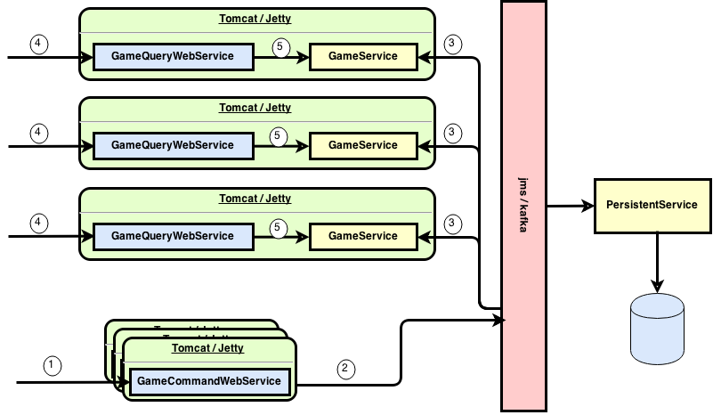
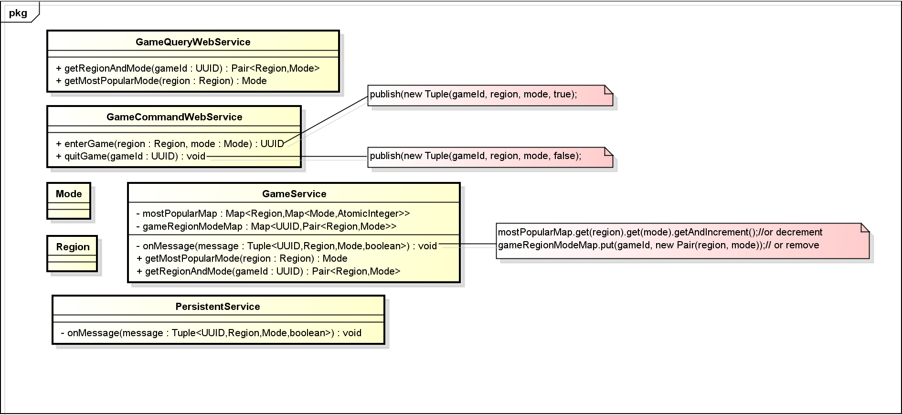

Question #1
---------------
When we have 2 xboxes and 120 stories, to get the minimum number of tries, there must exist a lowest level where we do the first drop test, from which if the xbox breaks, we have to go down to the first floor and test every floor up, and if the xbox does not break, we will go up one level less then the current floor's number and continue with our tests. So assume the lowest floor where we start the dropping test is n, it is something like this:
>n + (n-1) + (n-2) + (n-3) + (n-4) + … + 1  >=  120

So **n is 15**.

There is also a programmable way to solve this problem. Assuming that the building is k stories high, and we have n xboxes to test with.

If we drop the xbox at x-th story (1<=x<=k), there are two possible scenarios:
> - 1) the xbox is broken. This means we have n-1 xboxes left, and the lowest story is between 1 and x, which means there is x-1 stories to test.
> - 2) the xbox is not broken. This means we still have n xboxes left, and the lowest story is between x+1 and km, which means there is k-x stories to test.

Let's define dropXbox(n,k) as the number you have to test in the worst case scenario when you have n xboxes and k stories. At x story, where you drop the xbox for the first time, your worst case scenario is max(dropXbox(n-1,x-1),dropXbox(n,k-x)). In order to get the smallest number of tests in all the worst cases, you have to try everyone of the stories, so dropXbox(n,k)=min(max(dropXbox(n-1,x-1),dropXbox(n,k-x)))+1:x in {1,2,...,k}. We need to add one because we already tested one time at that story. Please refer to DropXbox.java and DropXboxTest.java to see how it is done.

This problem can also be solved by Dynamic Programming. Due to time constraints, here is only the recursion solution for it.

Question #2
---------------
**Assumptions**

> - The player has to quit the game to change the region or mode.
> - Region and Mode are both enums.
> - Assume an average player will join or quit a game every 5 to 10 minutes.

**Restful API specification**

We will have four restful web services. And with Jersey annotations they are
>**"enterGame" web service**

    @PUT

    @Path("/gameCommandWebService/enterGame")

    @Consumes(MediaType.APPLICATION_JSON)

    @Produces(MediaType.APPLICATION_JSON)

    Input type is a json payload of Region (an enum value) and Mode (an enum value).

    Output type is UUID, which is the system generated game ID.

>**"quitGame" web service**

    @PUT

    @Path("/gameCommandWebService/quitGame")

    @Consumes(MediaType.APPLICATION_JSON)

    Input type is a json payload of UUID for an existing game.

    There will be no output, but just a HTTP 200 to indicate OK or other HTTP status code.

>**"getRegionAndMode" web service**

    @GET

    @Path("/gameQueryWebService/getRegionAndMode/{gameId}")

    @Produces(MediaType.APPLICATION_JSON)

    @PathParam("gameId") - UUID

    Output type is Pair&lt;Region, Mode>, which is the corresponding region and mode for the game ID. It will return null if no such game ID is found.

>**"getMostPopularMode" web service**

    @GET

    @Path("/gameQueryWebService/getMostPopularMode/{region}")

    @Produces(MediaType.APPLICATION_JSON)

    @PathParam("region") - Region

    Output type is Mode, which is the most popular mode for the given region.
    
    
    
**Service layer design**

Please refer to the "Explanation" section for the details about the above system design picture.

**Persistence layer design**

The persistence layer will store all the events it received in an Event Sourcing style. Assuming there is already a Region table and Mode table, it will persist the following fields for each event in the database (oracle):
    
    Field Name | Type
    ---------- | -----
    id         | NUMBER
    gameId     | NUMBER
    region     | NUMBER
    mode       | NUMBER
    enterOrQuit| NUMBER
    timestamp  | DATE
    
   where id is an sequence and gameId is the foreign key to a Game table
   
    Field Name | Type
    ---------- | -----
    id         | NUMBER
    UUID       | varchar(36)

So each and every event (gameId, region, mode, enterOrQuit) will be recorded in the database together with a timestamp. This event sourcing style persistence will help us replay all the events and show the state of the system in any past point of time of interest. For example we can easily find what the most popular game mode for a region at 2pm yesterday from a reporting perspective. We can even save calculation cost by calculating every, say, 10000 events. It is like taking snapshots, and a new calculation can be calculated from its most recent snapshot point. 

**Explanation**

For scalability reasons, we can put "enterGame" web service and "quitGame" web service into a separate deployment other than the other two web services. So when "enterGame" web service is called, it will generate a new game id, asynchronously send the game id, region, mode and enterOrQuit=true over to JMS (or preferably kafka) and return the game id. When "quitGame" web service is called, it will just asynchronously send the game id, region, mode and enterOrQuit=false over.

Kafka will then publish the event to all its subscribers, which are the GameService instance(s) living in the same JVM as the GameQueryWebService instance(s). Upon receiving the event, the GameService will grab the counter for the corresponding region and mode from its "mostPopularMap" and start some atomic operation to either increase or decrease the counter by one. There will be no concurrent contentions for the "mostPopularMap", since all the keys are pre-defined (region and mode), and the value (the counter) is accessed using atomic operations. The GameService will also need to update the "gameRegionModeMap", which will be a ConcurrentHashMap. It will add an entry for an enterGame event, and remove an entry for the quitGame event.

When "getRegionAndMode" web service or "getMostPopularMode" web service is called, the web service will call the same method in GameService. "getRegionAndMode" in GameService will simply return the value in "gameRegionModeMap" by the game ID, and "getMostPopularMode" in GameService will get the Mode with the largest counter value in a specific region.

This architecture should scale to support millions of concurrent users as it is designed to provide near linear scalability. We can simply add more web containers to share the load of concurrent users. The state of region/mode is cached locally in the same JVM as the web service. Each web container has its own complete copy of that state. The only possible bottleneck would be the JMS/kafka message broker. But by using kafka which has higher throughput and scalability compared with JMS, and can be clustered, it should be able to handle that amount of load. Also, when GameService receives an event, it can utilize the Actor model to process more complicated logic, in order to achieve greater performance. We did not use an actor here because the logic here is simple enough and by using AtomicInteger we already ensure sequential processing without locking.

Question #3
---------------
Please refer to MatrixOrder.java for the solution. I would verify the correctness of my solution by unit testing. Please refer to MatrixOrderTest.java for all the unit test cases.

Question #4
---------------
Please refer to ItoA.java for the solution and ItoATest.java for the unit tests.
